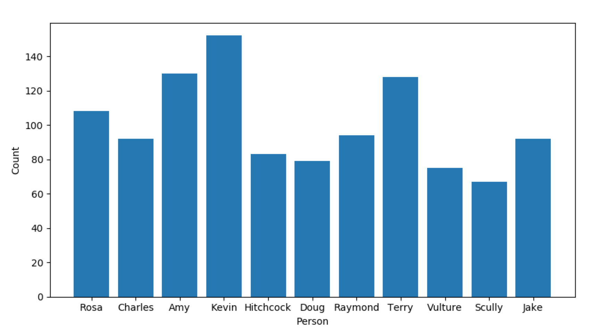

# ROSSINI
RandOmized diScuSsIoN group leader selectIon
---

Tired of always being short of volunteers for paper club? Tired of always leading group discussion despite having class and teaching 
responsibilities? Look no further. _ROSSINI_ is a simple randomizer that, given a list of people... randomly selects one! 
However, you can initialize the probability distribution as a "tiered" uniform distribution, allocating a higher 
likelihood of being slected to folks in a certain tier (such as those who aren't teaching, for example). No more excuses!
Simply throw the folks' names in a file (such as `tpeople.dat`) and run `rossini.py`. By default, the previous 
leaders are stored in a file (such as `people_old.dat`). We have the option, then, to remove the 
previous discussion leader from the distribution prior to computing the weights.
To do so, simply set the flag `REMOVE_PREV = True` at the top of `rossini.py`. No one wants to get stuck leading multiple times 
in a row because of bad luck!

Example distribution assuming characters from Brooklynn 99 are participating and some tiering of their involvement:

Currently, it's just a semi-uniform probability distribution where the weights in each "tier" proportional to each other 
by some factor `f = 3.0/4.0`.