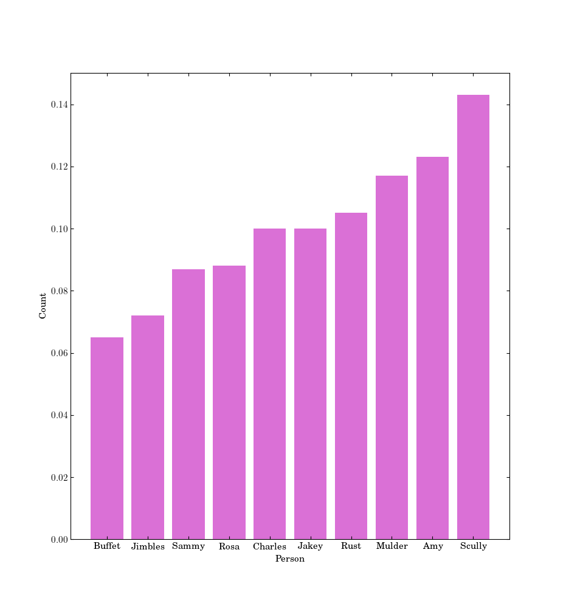

# ROSSINI
RandOmized diScuSsIoN group leader selectIon
---

Tired of always being short of volunteers for paper club? Tired of always leading group discussion despite having class and teaching 
responsibilities? Look no further. PLUNDER is a simple randomizer that, given a list of people... randomly selects one! 
However, you can initialize the probability distribution as a "tiered" uniform distribution, allocating a higher 
likelihood of being slected to folks in a certain tier (such as those who aren't teaching, for example). No more excuses!
Simply throw the folks' names in a file (such as `test_people.dat`) and run `rossini.py`.

Example distribution assuming characters from Brooklynn 99 are participating and some tiering of their involvement:
